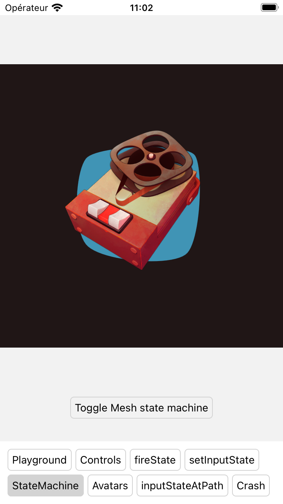
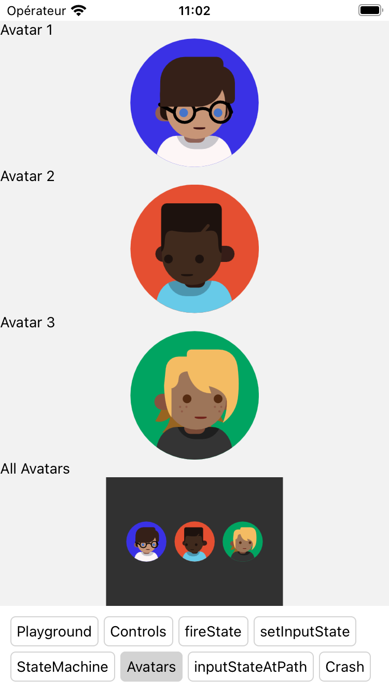

# Playground for Rive

Just a little playground to:

- make some tests with Rive
- have some examples from [Documentation](https://github.com/rive-app/rive-react-native/tree/main/example)
- list some usefull doc/helpers.

## Screenshots

|               Playground                |               Controls                |               Fire State                |
| :-------------------------------------: | :-----------------------------------: | :-------------------------------------: |
|  |  |  |

|               Set Input State                |               Mesh State Machine                |               Avatars                |               InputStateAtPath                |
| :------------------------------------------: | :---------------------------------------------: | :----------------------------------: | :-------------------------------------------: |
|  |  |  |  |

## Table of contents

- [Get started](#get-started)
- [Environment](#environment)
- [Issues](#issues)
- [Feature](#feature)
- [Helpers](#helpers)
  - [Handle .RIV assets with expo-custom-assets](#handle-riv-assets-with-expo-custom-assets)
  - [Handle .RIV assets with resolveAssetSource custom config](#handle-riv-assets-with-resolveassetsource-custom-config)

## Get started

1. Install dependencies

```bash
yarn install
```

2. Build and run the app

```bash
yarn ios
yarn android
```

## Environment

- Expo: ~52.0.7
- React Native: 0.76.2
- Yarn: 4.5.1
- Rive: 8.1.0

⚠️ `rive-react-native` version `8.1.0` seems to fix the folowing issue:

- https://github.com/rive-app/rive-react-native/issues/272
- https://github.com/rive-app/rive-react-native/issues/268

## Feature watched

[Assets Loader](https://rive.app/community/doc/loading-assets/doct4wVHGPgC#handling-assets) needed for RN

- https://github.com/rive-app/rive-react-native/issues/271
- https://github.com/rive-app/rive-react-native/issues/236

## Helpers

### Handle .RIV assets with `expo-custom-assets`

To automatically load `.riv` files inside native folders without pass by `Xcode` and `Android Studio` then use `<Rive />` `resourceName` property to load assets from them.

1. Install [expo-custom-assets](https://github.com/Malaa-tech/expo-custom-assets) module:

```bash
yarn add expo-custom-assets
```

2. Add animations `.riv` in a specific folder (ex: `./assets/animations`)

3. Modify the `app.json` config:

```json
{
  "expo": {
    // ...
    "plugins": [
      // ...
      [
        "expo-custom-assets",
        {
          // Path to the folder with the animations
          "assetsPaths": ["./assets/animations"]
        }
      ]
    ]
  }
}
```

4. Add automatically the `.riv` files in the native folders `ios` and `android`:

```bash
# For both platforms
npx expo prebuild
# For a specific platform
npx expo prebuild --platform ios
npx expo prebuild --platform android
```

5. Use the `<Rive />` component with the `resourceName` property:

```tsx
import Rive from "rive-react-native";

<Rive resourceName="animation_name.riv" />;
```

### Handle .RIV assets with `resolveAssetSource` custom config

To automatically use `.riv` local files in custom wrapper component without the need to import them in the native folders.

⚠️ However, it seems to be some unexpected behaviour.
When this solution is implemented, when you set animation on iOS (example below with `bouncing` and `idle`), there is a white flash at each switch.

```tsx
const [animation, setAnimation] = useState<"bouncing" | "idle">("idle");

return (
  <>
    <RiveAnimation source={truckV7} animationName={animation} />
    <Button onPress={() => setAnimation("bouncing")}>Play bouncing</Button>
    <Button onPress={() => setAnimation("idle")}>Play idle</Button>
  </>
);
```

Maybe consider using [Handle .RIV assets with expo-custom-assets](#handle-riv-assets-with-expo-custom-assets) for production 🤷‍♂️

1. Modify the `metro.config.js` file:

If the file doesn't exist, generate it with the command:

```bash
npx expo customize metro.config.js
```

Then update it:

```js
// Learn more https://docs.expo.io/guides/customizing-metro
const { getDefaultConfig } = require("expo/metro-config");

/** @type {import('expo/metro-config').MetroConfig} */
const config = getDefaultConfig(__dirname);

// ADD THIS LINE
config.resolver.assetExts.push("riv");

module.exports = config;
```

2. Add animations `.riv` in a specific folder (ex: `./assets/animations`)

3. Add type declaration for `.riv` files:

If you don't have any `types.d.ts` file, create it and add to it the following:

```ts
declare module "*.riv" {
  const content: string;
  export default content;
}
```

Then update the `tsconfig.json` file to include the `types.d.ts` file:

```json
{
  "extends": "expo/tsconfig.base",
  "compilerOptions": {
    // ...
  },
  "include": [
    // ...
    "path/to/your/types.d.ts"
  ]
}
```

4. Create a custom component to wrap the `<Rive />` component:

Create a component `RiveAnimation` with the following content:

Source for the base: https://github.com/rive-app/rive-react-native/issues/185#issuecomment-2322810427

```tsx
import React, { forwardRef, useMemo } from "react";
import Rive, { RiveRef } from "rive-react-native";
// @ts-ignore
import resolveAssetSource from "react-native/Libraries/Image/resolveAssetSource";

type RiveComponentProps = Omit<
  React.ComponentProps<typeof Rive>,
  "url" | "resourceName"
> & {
  source: string | number;
};

const isValidUrl = (uri: string | undefined): boolean => {
  if (!uri) return false;
  return uri.startsWith("http") || uri.startsWith("file");
};

export const RiveAnimation = forwardRef<RiveRef, RiveComponentProps>(
  (props, ref) => {
    const { source, ...riveProps } = props;

    const riveConfig = useMemo(() => {
      if (typeof source === "string" && isValidUrl(source)) {
        return { url: source };
      }

      const resolved = resolveAssetSource(source);
      const uri = resolved?.uri;
      const isUrl = isValidUrl(uri);

      return {
        resourceName: !isUrl && uri ? uri : undefined,
        url: isUrl ? uri : undefined,
      };
    }, [source]);

    return <Rive ref={ref} {...riveProps} {...riveConfig} />;
  }
);
```

5. Use the `<RiveAnimation />` component instead of the `<Rive />` component:

- with import:

```tsx
import React from "react";
import { RiveAnimation } from "../components/RiveAnimation";

import truckV7 from "../assets/animations/truck_v7.riv";

export default function Playground() {
  return <RiveAnimation source={truckV7} />;
}
```

- with require:

```tsx
import React from "react";
import { RiveAnimation } from "../components/RiveAnimation";

export default function Playground() {
  return (
    <RiveAnimation source={require("../assets/animations/truck_v7.riv")} />
  );
}
```

- with remote url:

```tsx
import React from "react";
import { RiveAnimation } from "../components/RiveAnimation";

export default function Playground() {
  return (
    <RiveAnimation
      source={
        "https://public.uat.rive.app/community/runtime-files/148-325-tape.riv"
      }
    />
  );
}
```
